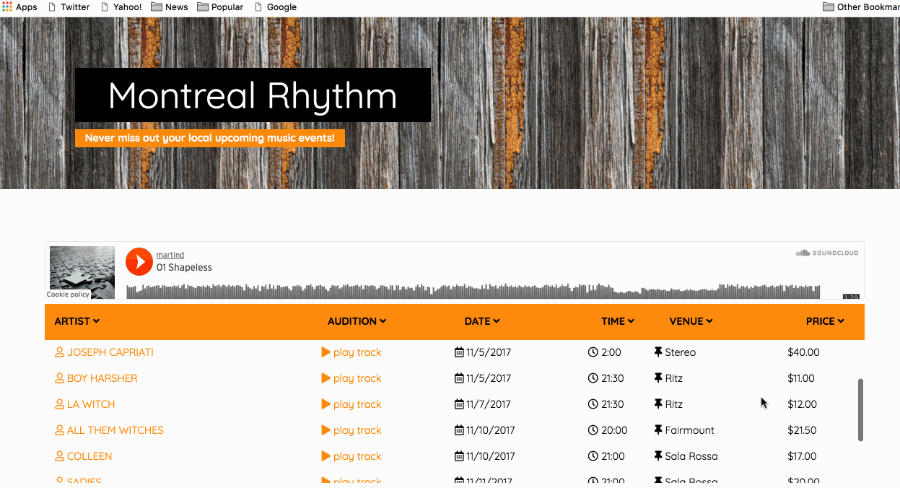

# musicapp
Music app demo project built with Reactjs and some public APIs. 

## Table of Contents
1. [Directories](#directories)
2. [Setup](#setup)
3. [Highlights](#highlights)
4. [Demo](#demo)
5. [Todo](#todo)

## [Directories](#directories)
    |-- public
        ...
    |-- src
        |-- ...
    |-- package.json
    |-- README.md
    |-- musicdemo.gif


## [Setup](#setup)
Make sure that you have the appropriate `"devDependencies"` and `"dependencies"` entries in `/package.json` and run `npm install`:

### To start

```
npm install
npm start
```

## [Highlights](#highlights)
* Dynamic loading while mouse scroll to load music event 6 by 6 to reduce memory usage.
* Play sample tracks on the fly.
* Table sortable with all the columns.
* Table sortable with all the columns.
* Artist info fetch (with [randomuser api](https://randomuser.me/))

## [Demo](#demo)


## [Todo](#todo)
- [ ] Display adjustment for various screensize
- [ ] More functionalities
